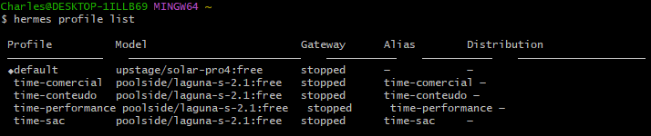
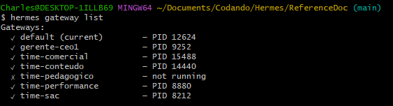

# Criando Profile

Temos várias forma de criar novos profiles, utilizando a própia plataforma do Hermes (app) ou via terminal com comandos.
Existe uma tendência de evitar a utilização de comandos via terminal, mas através dos comando temos muitas opções de configuração que ainda (até a data deste documento) o App ainda não conseguiu fornecer na sua plenitude. Então para termos uma melhor cobertura do que queremos, as instruções seguiram via comando, e para facilitar a criação do profile vamos rodar um script no terminal para completar as configuração do nosso novo profile.

> [!NOTE]
> Para entendendo o que cada linha do script faz, leia os seguinte arquivo: </br>
> ⇒ [create-profile_win.md](./telegram/scripts/create-profile_win.md) </br>
> Ou exponha estes arquivos para uma IA e peça as explicações e verificações de segurança.

* Para sistemas operacionais Windows utilize o arquivo [create-profile_win.sh](./telegram/scripts/create-profile_win.sh)
* Para sistemas operacionais Linux utilize o arquivo [create-profile_lin.sh](./telegram/scripts/create-profile_lin.sh)

Os comando podem ser diferentes conforme o sistema operacional. Como neste caso eu estou rodando em uma máquina local e a maioria das pessoas utiliza Windows, vou dar o exemplo utilizando comando para o OS Windows, mas a lógica continua a mesma para qualque OS.

> [!NOTE]
> Lembre que se for trabalhar com vários profiles o ideal é configurar um gateway multiplexido, pois desta forma facilita o gerenciamento do gateway, já que os gateways ficam legado a apenas um PID, ou seja compartilham do mesmo gateway do perfil default.

## Step 1. Preparando o script

1. Agora abra o arquivo [create-profile_win.sh](./telegram/scripts/create-profile_win.sh) em um editor de código (IDE) de sua preferência:
    Este são alguns exemplos, mas tem uma dezena de IDE para códigos

    * [Visual Studio Code_MicroSoft](https://code.visualstudio.com/download?_exp_download=fb315fc982)
    * [Antigravity IDE_Google](https://antigravity.google/product/antigravity-ide)
    * [NotePad++](https://notepad-plus-plus.org/downloads/)

    Edite o arquivo e coloque **NOME**, **MEU_ID**, **TOKEN** que se encontra no início do script (use a planilha [profile_list.xlsx](./telegram/profiles_list.xlsx) para auxiliar).
    Exemplo:

    ```bash
    NOME=time-perfomance
    MEU_ID=(gerado no Telegram ao rodar o @userinfobot)
    TOKEN=(gerado no Telegram quando criado o bot)
    ```

2. Salve o arquivo e depois retorne ao terminal Bash;
3. Navegue pelo terminal até a pasta onde se encontra os arquivos;
4. Execute o script com o seguinte comando:  

    ```bash
    bash create-profile_win.sh
    ```

5. Aguarde o processor finalizar acompanhando os outputs no terminal;
6. Caso queira criar mais profiles, abra novamente o arquivo e altere os dados para o próximo agente e repita a execução do script;
7. Continue repetindo este processo até cadastrar todos os profiles.
8. Para conferirmos se todos os agentes foram cadastrados no Hermes, execute novamente o comando no terminal:

    ```bash
    hermes profile list
    ```

    Vamos ter algo como:

    

## Step 2. Reativando os Gateways dos Profiles

> [!NOTE]
Para ambiente windows localmente após a restart do gateway via terminal não podemos fecha-lo, caso contrário os processos dos gateways serão encerrados, pausando dos agentes.

Sempre que você estiver rodando em uma VPS em ambiente Linux/Windows será necessário a reativação dos gateways para os profiles de forma manual sempre que:

* Atualizar o Hermes Agent
* Precisou parar o Hermes por algum motivo
* O servidor (VPS) foi reiniciado

Antes de resetar os processos do gateway podemos primeiramente executar o comando (`hermes profile list`) para verificar se os gateways estão com status **running** ou **stopped**.

```text
              Hermes Gateway
                    │
                    │
          ┌─────────┴─────────┐
          │                   │
       default             profiles...
       stopped             stopped
```

Para forçarmos a reativação dos gateway abra o terminal e execute o comando para cada profile ou execute o script:

### ⟹ Para sistemas operacionais Windows utilize:

1. Executando por comando para cada profile.

    ```bash
    hermes -p <profile_name> gateway run --replace > /tmp/<profile_name>-gateway.log 2>&1 &
    sleep 8
    hermes gateway list
    ```

2. Executando por Script -> [wakeup-gateway_win.sh](./telegram/scripts/wakeuo-gateway_win.sh)
3. E para ver as portas que cada Gateway esta rodando utilize o comando `hermes gateway list`.
</br>
    

### ⟹ Para sistemas operacionais Linux utilize:

1. Executando por comando para cada profile.

    ```bash
    setsid hermes -p <profile_name> gateway run --replace > /tmp/<profile_name>-gateway.log 2>&1 &
    sleep 8
    hermes gateway list
    ```

2. Executando por escript -> [wakeup-gateway_lin.sh](./telegram/scripts/wakeup-gateway_lin.sh)
3. E para ver as portas que cada Gateway esta rodando utilize o comando `hermes gateway list`
