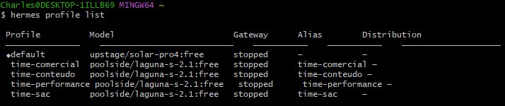
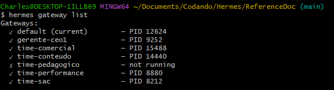

# Criando Profile

Temos várias forma de criar novos profiles, utilizando a própia plataforma do Hermes (App) ou via terminal com comandos.
Existe uma tendência de evitar a utilização de comandos via terminal, mas através dos comando temos muitas opções de configuração que o App ainda não conseguiu fornecer na sua plenitude (até a data deste documento). Então para termos uma melhor cobertura do que queremos, as instruções seguiram via comando, e para facilitar a criação do profile vamos rodar um script no terminal para completar as configuração do nosso novo profile.

> [!NOTE]
> Para entendendo o que cada linha do script faz, leia os seguinte arquivo:
>
> ⇒ [explicando_script_create-profile.md](./telegram/scripts/explicando_script_create-profile.md)
>
> Ou exponha estes arquivos para uma IA e peça as explicações e verificações de segurança.

* Para sistemas operacionais Windows utilize o script [create-profile_win.sh](./telegram/scripts/create-profile_win.sh)
* Para sistemas operacionais Linux utilize o script [create-profile_lin.sh](./telegram/scripts/create-profile_lin.sh)

Os comando podem ser diferentes conforme o sistema operacional. Como neste caso eu estou rodando em uma máquina local e a maioria das pessoas utiliza Windows, vou dar o exemplo utilizando comando para o OS Windows, mas a lógica continua a mesma para qualque OS.

> [!NOTE]
> Lembre que se for trabalhar com vários profiles o ideal é configurar um gateway multiplexido, pois desta forma facilita o gerenciamento do gateway, pois os gateways ficam legado a apenas um PID, ou seja, compartilham do mesmo gateway do perfil default.

---

## Step 1. Preparando o script

1. Agora abra o arquivo [create-profile_win.sh](./telegram/scripts/create-profile_win.sh) em um editor de código (IDE) de sua preferência:
    Este são alguns exemplos, mas tem uma dezena de IDE para códigos (todos free)

    * [Visual Studio Code_MicroSoft](https://code.visualstudio.com/download?_exp_download=fb315fc982)
    * [Antigravity IDE_Google](https://antigravity.google/product/antigravity-ide)
    * [NotePad++](https://notepad-plus-plus.org/downloads/)
    </br>

    No inicio do script temos o bloco de variáveis que devemos alterar para cada profile, portanto edite este trecho do código e coloque as informações necessárias solicitada. (use a planilha [profile_list.xlsx](./telegram/profiles_list.xlsx) para auxiliar).
    Exemplo:

    ```text
    PROFILE_NAME_RAW="<name>"               # Nome do profile
    CHANNEL_NAME="<bot_name>"               # Nome amigável do bot (TELEGRAM_HOME_CHANNEL_NAME)
    USER_ID="<ID_number>"                   # User ID do Telegram (DM) — pode adicionar vários separando por ,
    DIRETORIO_HERMES="<local_do_hermes>"    # Caminho onde está o diretório do Hermes (geralmente em $HOME/AppData/Local/hermes para Windows)
    ```

2. Salve o arquivo e depois retorne ao terminal Bash;
3. Navegue pelo terminal até a pasta onde se encontra o script;
4. Execute o script com o seguinte comando:
    > [!NOTE]
    > **Obs**.: Como não adcionamos o BOT_TOKEN ao script, vamos primeiramente carregar uma variável de ambiente para o shell para ser usado pelo script. Desta forma garantimos que o TOKEN não fique acidentalmente salvo no script e após a execução esta variável de ambiente é esvasiado, garantindo também que não ficou no terminal.

    ```bash
    export TELEGRAM_BOT_TOKEN="<cole aqui o seu BOT_TOKEN>"
    ```

    Confirme com \<ENTER>, e execute o script com o comando:

    ```bash
    bash create-profile_win.sh
    ```

5. Aguarde o processo finalizar acompanhando os outputs no terminal;
6. Caso queira criar mais profiles, abra novamente o arquivo `create-profile_win.sh` e altere os dados para o próximo agente e repita a execução do script;
7. Continue repetindo este processo até cadastrar todos os profiles.
8. Para conferirmos se todos os agentes foram cadastrados no Hermes, execute novamente o comando no terminal:

    ```bash
    hermes profile list
    ```

    Vamos ter algo como:

    

---

> [!NOTE]
> Caso esteja vindo do arquivo de instrução, como configurar o gateway multiplex (config_gw_multiplex.md), onde é utilizando a configuração do gateway com protocolo **multiplex**, não será necessário a execução das próximas etapas. Retorne para a instrução [configuração do gateway multiplex](config_gw_multiplex.md) e continue a partir de lá.
> As etapas seguintes se destina a gateway com protocolo **single-channel**.

---

## Step 2. Reativando os Gateways dos Profiles

> [!NOTE]
Para ambiente windows localmente após a restart do gateway via terminal não podemos fecha-lo, caso contrário os processos dos gateways serão encerrados, pausando dos agentes.

Sempre que você estiver rodando em uma VPS em ambiente Linux/Windows será necessário a reativação dos gateways para os profiles de forma manual sempre que:

* Atualizar o Hermes Agent
* Precisou parar o Hermes por algum motivo
* O servidor (VPS) foi reiniciado

Antes de resetar os processos do gateway podemos primeiramente executar o comando (`hermes profile list`) para verificar se os gateways estão com status **running** ou **stopped**.

```text
              Hermes Gateway
                    │
                    │
          ┌─────────┴─────────┐
          │                   │
       default             profiles...
       stopped             stopped
```

Para forçarmos a reativação dos gateway abra o terminal e execute o comando para cada profile ou execute o script:

### ⟹ Para sistemas operacionais Windows utilize:

1. Executando por comando para cada profile.

    ```bash
    hermes -p <profile_name> gateway run --replace > /tmp/<profile_name>-gateway.log 2>&1 &
    sleep 8
    hermes gateway list
    ```

2. Executando por Script -> [wakeup-gateway_win.sh](./telegram/scripts/wakeup-gateway_win.sh)
3. E para ver as portas que cada Gateway esta rodando utilize o comando `hermes gateway list`.
</br>
    

### ⟹ Para sistemas operacionais Linux utilize:

1. Executando por comando para cada profile.

    ```bash
    setsid hermes -p <profile_name> gateway run --replace > /tmp/<profile_name>-gateway.log 2>&1 &
    sleep 8
    hermes gateway list
    ```

2. Executando por escript -> [wakeup-gateway_lin.sh](./telegram/scripts/wakeup-gateway_lin.sh)
3. E para ver as portas que cada Gateway esta rodando utilize o comando `hermes gateway list`
