# PROJETO DE MULTIPLOS AGENTES - Telegram

## Objetivo

Construir um projeto com 5 Agentes com um bot orquestrador das atividades, aplicando recursos de intareção via Telegram e registros no Notion.

## Recursos Nescessários

Para a execução deste projeto é necessário ter os seguintes recursos:

> [!IMPORTANT]
> 1_ Ter uma VPS (ideal para rodar 24/7) ou utilize o seu PC local (preferencialmente no Docker)
> 2_ Hermes Agent instalado  
> 3_ Disponibilidade de algum modelo LLM da sua preferencia  
> 4_ Uma conta no Telegram para criarmos os bot (agentes)  
> 5_ Uma conta no Notion para registrarmos a execução do trabalho dos agentes  

## Estrutura do Projeto

Para a implantação de um sistema de orquestração com multiplos agentes, vamos adodar a seguinte estrutura de Agentes

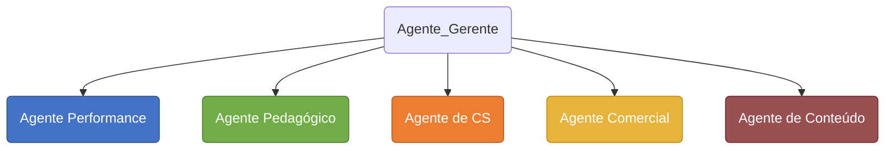

OS AgenteS terão as seguntes funções dentro da estrutura:

**- Agente Performance:**
Responsável por planejar, executar e otimizar campanhas de mídia paga (como Google Ads e Meta Ads). Monitora métricas como ROI, CPA e conversões, ajustando estratégias para maximizar o retorno sobre o investimento e reduzir custos.

**- Agente Pedagógico:**
Responsável pela estruturação e validação de conteúdos educacionais. Garante a qualidade didática, a progressão lógica do aprendizado e a adequação da linguagem ao público-alvo, assegurando que os materiais cumpram os objetivos de ensino.

**- Agente Customer Service_CS:**
Responsável pelo atendimento e suporte aos clientes. Resolve dúvidas, soluciona problemas, gerencia reclamações e garante a satisfação do usuário, atuando como o principal ponto de contato entre a empresa e o público.

**- Agente Comercial:**
Responsável pela prospecção e conversão de leads em clientes. Realiza vendas, negociações, apresenta propostas e mantém o relacionamento com o cliente para fechar contratos e atingir as metas de receita.

**- Agente de Conteúdo:**
Responsável pela criação, curadoria e distribuição de conteúdo (textos, vídeos, imagens). Produz materiais relevantes para atrair, engajar e educar o público, alinhando a comunicação da marca às estratégias de marketing.

---

## 1. CONFIGURANDO OS BOTS NO TELEGRAM

> [!NOTE]
    Os prints do Telegram estão rodando em sistema **Android**, portanto para quem utiliza sistemas **IOS** os caminhos serão um pouco diferentes

### Step 1. Identificando seu ID no Telegram

Temos que identificar o ID do nosso Telegram, pois será a partir deste ID que nós estaremos conversando com os bots e vise versa.
> [!TIP]
> Caso tenha mais alguém que também vai interagir com os bots através do Telegram, então será necessário que este usuário recupere o número do ID dele para ser cadastrado.

Na barra de pesquisa do Telegram, busque por **`User Info`** e clique em ==@userinfobot==, será aberto uma janela de chat.

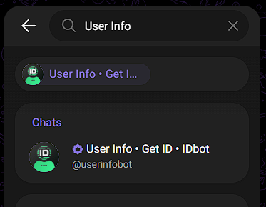
  
Neste chat, digite `/start`


Agora podemos ver que o bot retornou o nosso nome de usuário **@username** e logo abaixo temos o **id:XXXXXXXXX**

* Antes de proceguir vamos preencher uma tabela com os dados gerados, vamos precisar deles mais a frente para rodar o script de cadastro dos profiles dentro do Hermes.

* Abra a planilha [referencias_profiles.xlsx](./telegram/referencias_profiles.xlsx):

    

### Step 2. Ciando os Bots no Telegram

Temos que criar um **Bot** para cada **Agente** utilizando o `@BotFather` do Telegram.
Cada agente é um setor ou seja um departamento dentro de uma empresa

1. Abra o telegram e pesquise por BotFather na aba **Apps**.

      

2. Clique em `Create a New Bot`.

    
  
3. Dê um nome usando a referncia criada na planilha para o seu bot no campo **Bot name**, caso queira fazer uma descrição deste bot utilize a proxima linha. Em seguida dê um **username** (Obs: o username do bot **"deve"** terminar com ==**_bot**==) , ao clicar em criar, será gerado um token especifico para este bot. É com este token que usaremos para efetuar um Resquest via API HTTP

    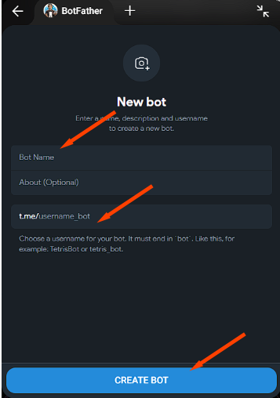
  
Ao termino da criação de todos os agentes teremos uma planilha com os Tokens e o ID do Orquestrador (neste caso você com o nome de Agente CEO)


Se selecionarmos a aba **Apps** no Telegram e depois clicar em **BotFather**, podemos ver que temos a seguinte estrutura de Bots


### Step 3. Ativar todos os bots

Agora vamos ativar (acordar) os bots no Telegram, cada um precisa receber um comando `/start` e assim, começar um chat com este agente.
Temos dois caminhos para acordar os bots:

1. Pela barra de pesquisa:
    1. Abra o seu Telegram e busque pela aba **Chats**, clique em perquisa e digite o **Username Bot**

        

    2. Selecione o bot e o chat deste bot vai ser carregado
    3. Clique no botão `START`
2. Pelo BotFather:
    1. Abra o seu Telegram e busqu8e pela aba **Apps**, clique ou busque por **BotFather**, será aberto a janela do botfather com a lista dos seus bots.
    2. Clique no bot que será acordado e em seguida clique no **PROFILE_NAME** (neste caso: `@agente_content_bot`)

        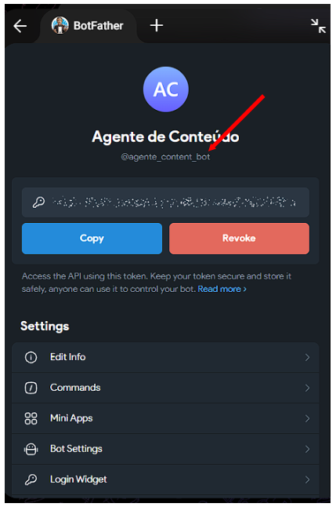

    3. Note que a janela de chat deste bot é carregada, então finalize clicando no botão `START`

---

## 2. CONFIGURANDO OS PROFILES NO HERMES

### Step 1. Criando Profiles Hermes

Quando fazemos a instalação do Hermes Agent obrigatoriamente temos que configurar um **profile default** que é a primeira solicitação do Hermes. Seguindo o passo a passo fornecido pelo instalador, vamos receber algumas perguntas de confirmações e fornecer algumas informações.
Caso vc já tenha instalado e tenha vários profiles, não é necessário desistalar, apenas escolha qual dos profiles e de preferencia o primeiro que foi criado para ser **setado como agente default**. E porque dissso?; Simplesmente poque o primeiro profile criado que é chamado de default cria toda a sua estrutura de pastas na raiz do Hermes, e consequentemente este profile poderá ser utilizado como base para (clonado) criação de outros profiles.</br>
Para saber a insformação do seu profile default vamos executar:

1. Abra o terminal **Git Bash** (obs. 1) ou o terminal CLI local do seu VPS na seção do Hermes.
    (obs. 1) - para acessar o terminal Git Bash é necessário ter o [Git instalado](https://git-scm.com/install/windows).
2. Execute o seguinte comando no terminal:

    ```bash
    hermes profile list
    ```

    Podemos verificar que temos inicialmente somente o profile padrão que é chamado de **default**. Este profile é criado na primeira vez que você instala o Hermes Agent.

    
    </br>

    Nosso objetivo é no final da configuração dos profiles termos uma estrutura:

    ```text
                 default
                    │
            ~/AppData/Local/hermes/
                    │
            ┌───────┴────────┐
            │                │
          GLOBAL          profiles/
            │                │
            │                ├───────────────────────────┬────────────┬...
         default          Agente1/                    Agente2/
            │                │                           │
          .env             .env                        .env
       config.yaml      config.yaml                 config.yaml
         SOUL.md          SOUL.md                     SOUL.md
            │                 │                           │
            │              Telegram                    Telegram
            │                 │                           │
            ▼                 ▼                           ▼
        gateway run       gateway run                 gateway run
            │                 │                           │
            ▼                 ▼                           ▼
          running          running                     running
    ```

### Step 2. Definindo o tipo de protocolo do gateway

Antes de criarmos os profiles de cada agente dentro do Hermes, temos que entender a diferença entre o protoloco **gateway single-channel e multiplex**.
Para uma aplicação de automação com conectores (chamado também de **Plataformas**) que tem ação externa e portanto vão ter request via API, o **gateway com protocolo single channel** atende perfeitamente quando temos apenas um agente interagindo (fazendo request) com a plataforma, mas quando vamos trabalhar com multiplos agentes e estes agentes também vão fazer request para o mesma plataforma, neste caso o ideal é o **gateway com > protocolo multiplex**.
É justamente o nosso caso, pois estaremos utilizando a plataforma Telegram para fazer a interação com multiplos agentes.
Vamos pausar um pouco aqui e seguir em outro documento, onde temos a explicação da diferença entre os protocolos e como implantar o protocolo **gateway multiplex**.

⇒ ⇒ Abra o arquivo [config_multiplex.md](config_gw_multiplex.md)</br>

Caso a sua aplicação tenha apenas um **único agente** interagindo com a plataforma, o recomendado é utilizar o **gateway single-channel protocol**, neste caso siga as instruções em:

⇒ ⇒ Abra o arquivo [config_newprofile.md](config_newprofile.md)

---

## 3. Organizar a empresa no Telegram

Os próximos passos compreende em organizar dentro do Telegram a estrutura da empresa e facilitar o acompanhamento do processo de trabalho dos grupos, portanto se você já tem experiência com este tipo de organização no Telegram, sinta-se a vontade para organizar da melhor forma ou siga os próximos passos para replicar a lógica da minha organização.
Então vamos organizar a estrutura da nossa empresa dentro do Telegram onde teremos uma pasta da empresa, um grupo por time, e o bot do agente dentro de cada grupo.
A lógica da organização:

* Cada grupo é um andar de um prédio;
* a pasta da empresa é o que junta os andares num prédio só;
* e cada agente entra no seu andar.

    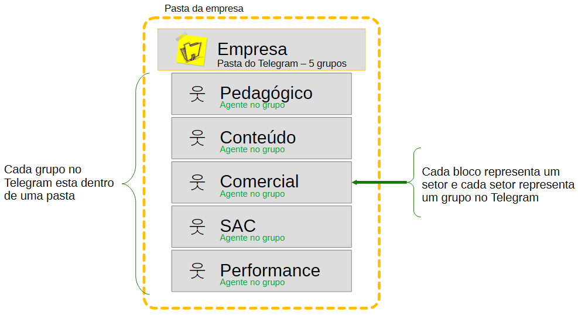

### Step 1. Criar um grupo por time

Vamos criar um grupo pra cada setor da empresa: Performance, SAC, Comercial, Conteúdo, Pedagógico.

1. No Telegram selecione a aba **Unread** (mas pode ser outra) e clique no icone de um lápis no rodapé da tela
2. Um menu será mostrado, clique em **New Group**

    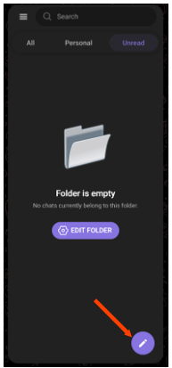 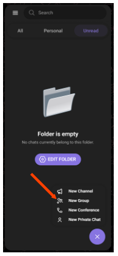

3. Nesta nova janela localise no rodapé uma seta, clique sobre ela e podemos ver agora uma janela para entrarmos com o nome deste novo grupo (neste exemplo estou entrando com o nome do "Time de Performance"), finalise clicando na seta no rodapé da pagina

    

4. Podemos observar que foi carregado um chat vazio com o nome do nosso grupo na parte superior

    

5. Agora repita os passos para criar os outros grupos

    

### Step 2. Criar a Pasta da Empresa

1. No Telegram posicione o ponteiro do mouse sobre a aba **All** e clique com o botão direito do mouse e clique em **Edit folders**, em seguida clique em **CRIAR PASTA**

    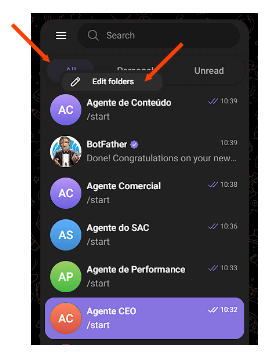 

2. Dê o nome da dua empresa ou do departamento principal, responssável pelos grupos.
3. Em seguida adicione todos os grupos que criamos para esta pasta, confirme no tick no canto superior direito

     

4. Verifique se todos os grupos foram incluidos e confirme a criação da pasta clicando no tick no canto superior direito.

    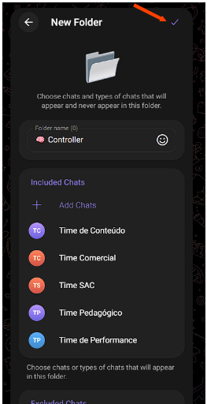 

5. Agora podemos observar que a pasta da empresa foi criada e se encontra como uma aba logo abaico da barra de pesquisa.

    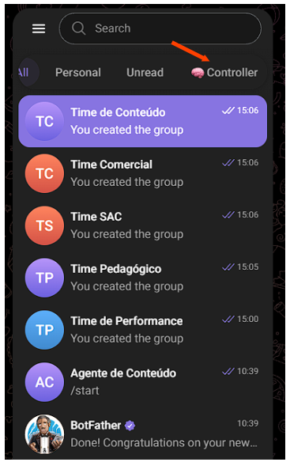 

### Step 3. Adcionar o Agente de Cada Grupo

1. Vamos adicionar cada Agente no seu respectivo Grupo, selecione e clique em um agente (neste caso será o Agente de Performance), será carregado o chat deste agente
2. Clique nos 3 pontinhos que esta no canto superior direito e selecione **Adicionar para Grupo**

    

3. Na próxima janela teremos a lista com os grupos para onde o agente será adicionado, neste caso selecione o drupo Time de Performance e confirme.
4. Agora entre no grupo do Time de Performance e clique sobre o título do grupo, perceba que será apresentado um popup "Grupo Info" onde temos 2 membros e o Agente de Performance

    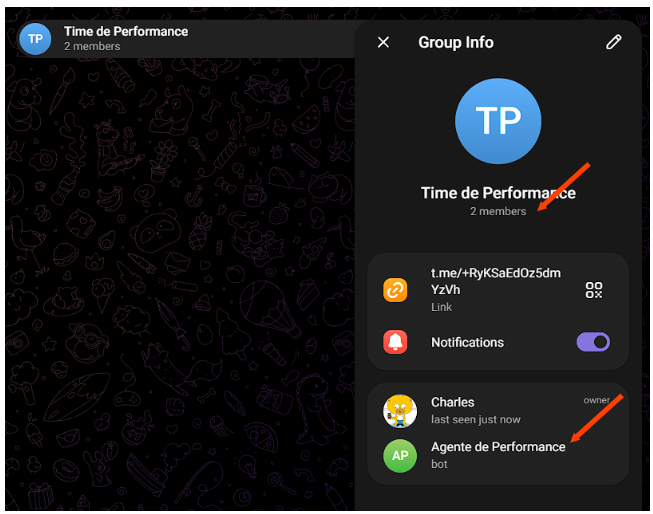

5. Clique sobre o lápis para editar o grupo e role para baixo até encontrar a opção **Administrators** (Administradores), neste caso só temos 1, que é você, mas queremos que o nosso agente passe a ser o administrador deste grupo também e para isso clique em Administrador
6. Uma nova janela é apresentada e confirma que temos somente um administrador, agora clique em adicionar no botão na parte inferior direita (1) e depois selecione o agente (2)

    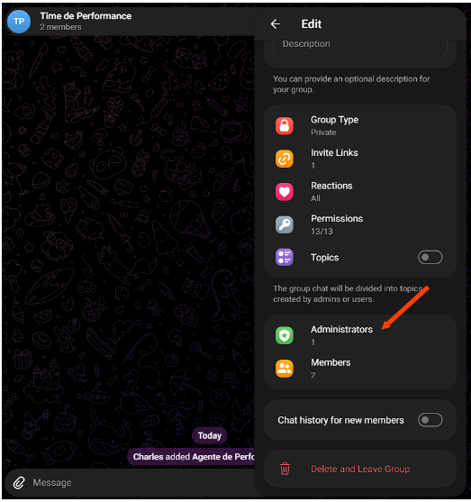 

7. É apresentado a janela com as opções de administrador, teremos que ativar a opção **Add New Admins** (1) (Adcionar Novo Administrador) e em seguida comfirmar (2)

    

8. Retorne atá a tela de chat, deppois clique novamente sobre o nome do grupo para entrar na tela da informação do grupo, repare que agora o nosso agente esta como **admin** e se você verificar a imagem no item 4, verá que esta opção não estava ativa para o nosso agente.

    

9. Repita todos os passos anteriores para fazer o mesmo para os outros agentes.

## 4. Colocando em Operação

### Testando a comunicação

Antes de colocarmos os agentes em operação, vamos testar se eles estão recebendo e retornando respostas via grupo.
> [!NOTE]
    Certifique-se de que a sua API key esta ativa no seu **Provider**, mesmo ser for free, caso seja uma assinatura paga, verifique se tem credito disponível para rodar os modelos escolhido.

Entre em um grupo e envie uma mensagem, por exemplo:  `Boa tarde, seja bem vindo ao grupo...`

Aguarde o agente responder no grupo, se isso acontecer esta tudo certo, então prossiga para os outros grupos e execute a mesma mensagem.
Caso o agente não esteja retornando ou mesmo alguma mensagem de erro, verifique primeiro:

* Se você estiver no Hermes Desktop, carregue o app e entre em config para verificar se o provider e o modelo estão funcinando e disponível
* Se necessário reinicie o gateway que pode ser pelo app ou através do terminal (lembrando que o terminal não poderá ser fechado).
    * No App clique em **Gateway** (1) no rodapé canto esquerdo
    * Depois clique no botão **Restart Gateway** (2)

    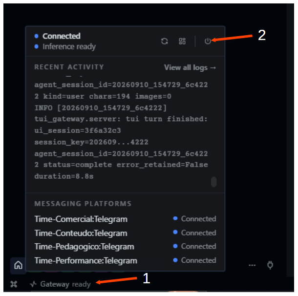

Depois tente novamente mandar a mensagem.
