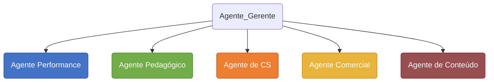
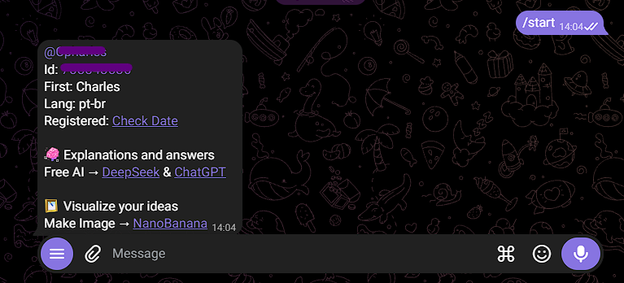
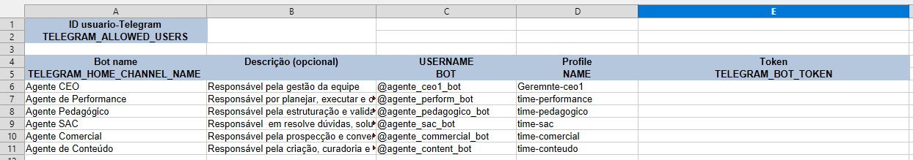
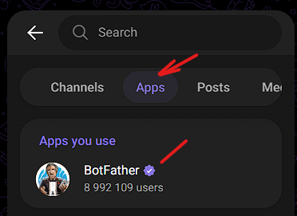
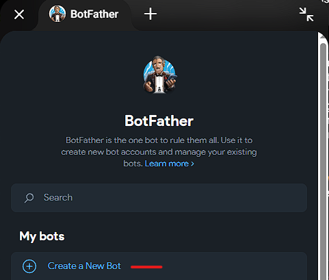
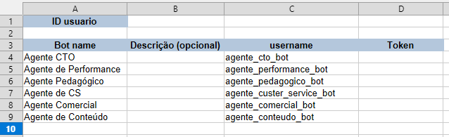
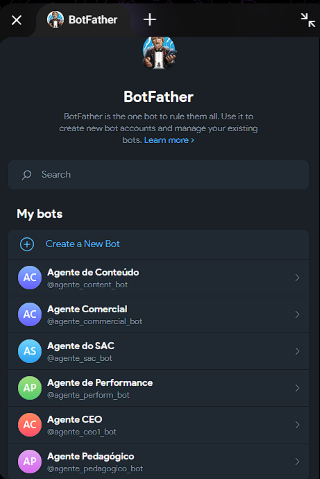
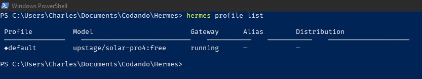
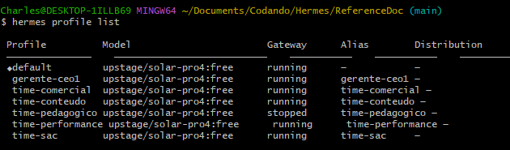

# PROJETO DE MULTIPLOS AGENTES

## Objetivo

Construir um projeto com 5 Agentes com um bot orquestrador das atividades, aplicando recursos de intareção via Telegram e registros no Notion.

## Recursos Nescessários

Para a execução deste projeto é necessário ter os seguintes recursos:

> * Ter uma VPS (ideal para rodar 24/7) ou utilize o seu PC local (preferencialmente no Docker)
> * Hermes Agent instalado
> * Disponibilidade de algum modelo LLM da sua preferencia
> * Uma conta no Telegram para criarmos os bot (agentes)
> * Uma conta no Notion para registrarmos a execução do trabalho dos agentes

## Estrutura do Projeto

Para a implantação de um sistema de orquestração com multiplos agentes, vamos adodar a seguinte estrutura de Agentes



OS AgenteS terão as seguntes funções dentro da estrutura:

**- Agente Performance:**
Responsável por planejar, executar e otimizar campanhas de mídia paga (como Google Ads e Meta Ads). Monitora métricas como ROI, CPA e conversões, ajustando estratégias para maximizar o retorno sobre o investimento e reduzir custos.

**- Agente Pedagógico:**
Responsável pela estruturação e validação de conteúdos educacionais. Garante a qualidade didática, a progressão lógica do aprendizado e a adequação da linguagem ao público-alvo, assegurando que os materiais cumpram os objetivos de ensino.

**- Agente Customer Service_CS:**
Responsável pelo atendimento e suporte aos clientes. Resolve dúvidas, soluciona problemas, gerencia reclamações e garante a satisfação do usuário, atuando como o principal ponto de contato entre a empresa e o público.

**- Agente Comercial:**
Responsável pela prospecção e conversão de leads em clientes. Realiza vendas, negociações, apresenta propostas e mantém o relacionamento com o cliente para fechar contratos e atingir as metas de receita.

**- Agente de Conteúdo:**
Responsável pela criação, curadoria e distribuição de conteúdo (textos, vídeos, imagens). Produz materiais relevantes para atrair, engajar e educar o público, alinhando a comunicação da marca às estratégias de marketing.

---

## 1. Configurações no Telegram

### Step 1. Identificando seu ID no Telegram

Temos que identificar o ID do nosso Telegram, pois será a partir deste ID que nós estaremos conversando com os bots e vise versa.
> **Obs.:**
> Caso tenha mais alguém que também vai interagir com os bots através do Telegram, então será necessário que este usuário recupere o número do ID dele para ser cadastrado.

Na barra de pesquisa do Telegram, busque por **`User Info`** e clique em ==@userinfobot==, será aberto uma janela de chat.


  
Neste chat, digite `/start`



Agora podemos ver que o bot retornou o nosso nome de usuário **@username** e logo abaixo temos o **id:XXXXXXXXX**

* Antes de proceguir vamos preencher uma tabela com os dados gerados, vamos precisar deles mais a frente para rodar o script de cadastro dos profiles dentro do Hermes.

* Abra a planilha [dados_profiles.xlsx](dados_profiles.xlsx):

    

### Step 2. Ciando os Bots no Telegram

Temos que criar um **Bot** para cada **Agente** utilizando o `@BotFather` do Telegram.
Cada agente é um setor ou seja um departamento dentro de uma empresa

1. Abra o telegram e pesquise por BotFather na aba **Apps**.

      
  
2. Clique em `Create a New Bot`.

    
  
3. Dê um nome usando a referncia criada na planilha para o seu bot no campo **Bot name**, caso queira fazer uma descrição deste bot utilize a proxima linha. Em seguida dê um **username** (Obs: o username do bot **"deve"** terminar com ==**_bot**==) , ao clicar em criar, será gerado um token especifico para este bot. É com este token que usaremos para efetuar um Resquest via API HTTP

    
  
Ao termino da criação de todos os agentes teremos uma planilha com os Tokens e o ID do Orquestrador (neste caso você com o nome de Agente CEO)



Se selecionarmos a aba **Apps** no Telegram e depois clicar em **BotFather**, podemos ver que temos a seguinte estrutura de Bots



## 2. Configuração dos Profiles no Hermes

### Step 1. Criando Profiles Hermes

Temos que criar os profiles de cada agente dentro do Hermes com seu respectivo Token junto com o ID do orquestrador, e para isso vamos rodar um script no terminal para completar esta configuração.

> Obs.: Para entendendo o que cada linha do script faz, leia os seguintes arquivos:
    [create-profile_win.md](./scripts/create-profile_win.md)
    ou exponha estes arquivos para uma IA e peça as explicações e verificações de segurança.

* Para sistemas operacionais Windows utilize o arquivo [create-profile_win.sh](./scripts/create-profile_win.sh)
* Para sistemas operacionais Linux utilize o arquivo [create-profile_lin.sh](./scripts/create-profile_lin.sh)

Os comando podem ser diferentes conforme o sistema operacional. Como neste caso eu estou rodando em uma máquina local e a maioria das pessoas utiliza Windows, vou dar o exemplo utilizando comando para o OS Windows, mas a lógica continua a mesma para qualque OS.

### Step 2. Verificando o status dos profiles no Hermes

1. Abra o terminal **Git Bash** ou o terminal CLI local do seu VPS na seção do Hermes (para acessa-lo é necessário ter o [Git instalado](https://git-scm.com/install/windows))
2. Execute o seguinte comando no terminal: `hermes profile list`
    Podemos verificar que temos inicialmente somente o profile padrão que é chamado de **default**

    

    Nosso objetivo é no final da configuração dos profiles termos uma estrutura:

    ```text
                 default
                    │
            ~/AppData/Local/hermes/
                    │
            ┌───────┴────────┐
            │                │
          GLOBAL          profiles/
            │                │
            │                ├───────────────────────────┬────────────┬...
         Profile          Agente1/                    Agente2/
            │                │                           │
          .env             .env                        .env
       config.yaml      config.yaml                 config.yaml
         SOUL.md          SOUL.md                     SOUL.md
            │                 │                           │
            │        Telegram + OpenRouter       Telegram + OpenRouter
            │                 │                           │
            ▼                 ▼                           ▼
        gateway run       gateway run                 gateway run
            │                 │                           │
            ▼                 ▼                           ▼
          running          running                     running
    ```

3. Agora abra o arquivo [create-profile_win.sh](./scripts/create-profile_win.sh) em um editor de coódigo como o Visual Studio Code ou outro editor de código, e coloque **NOME**, **MEU_ID**, **TOKEN** que se encontra no início do script (use a planilha [daddos_profile.xlsx](dados_profiles.xlsx) para auxiliar).
Exemplo:

    ```bash
    NOME=time-perfomance
    MEU_ID=(gerado no item 1 ao rodar o @userinfobot)
    TOKEN=(gerado no item 2 quando criado o bot)
    ```

4. Salve o arquivo e depois retorne ao terminal Bash;
5. Navegue pelo terminal até a pasta onde se encontra os arquivos;
6. Execute o script com o seguinte comando:  
    `bash create-profile_win.sh`
7. Aguarde o processor finalizar acompanhando os outputs no terminal;
8. Depois, abra novamente o arquivo e altere os dados para o próximo agente e repita a execução do script;
9. Continue repetindo este processo até cadastrar todos os profiles.
10. Para confirirmos se todos os agentes foram cadastrados no Hermes, execute o comando no terminal `hermes profile list`
    Vamos ter algo como:

    

11. Para ambiente windows localmente não podemos fechar o terminal, caso contrario os processos dos gateways dos profiles serão encerrados. Já para ambiente VPS isso não oscorre pois o sistema fica rodando 24/7 e só será necessário reiniciar caso seja realmente necessário.

### Step 3. Reativando os Gateways dos Profiles

Sempre que você estiver rodando localmente em ambiente Windows/linux será necessário a reativação dos gateways para os profiles de forma manual.
Primeiramente executar o comando (`hermes profile list`) para verificar que somente o profile default esta com status "running" os outros profile estão com gateway na condição **stopped**.

```text
              Hermes Gateway
                    │
                    │
          ┌─────────┴─────────┐
          │                   │
       default             profiles
       running             stopped
```

!!! Atenção: Se você estiver em um servidor e o mesmo foi reiniciado, este procedimento de reativação dos gateway dos profiles será necessário também.

Abra o terminal e execute o comando para cada profile ou execute o script:

1. ⟹ Para sistemas operacionais Windows utilize:

    Executando por comando

    ```bash
    hermes -p time-perfomance gateway run --replace > /tmp/<profile_name>-gateway.log 2>&1 &
    sleep 8
    hermes gateway list
    ```

    Executando por Script -> [wakeup-gateway_win.sh](./scripts/wakeuo-gateway_win.sh)
    <br/>
2. ⟹ Para sistemas operacionais Linux utilize:

    Executando por comando

    ```bash
    setsid hermes -p time-perfomance gateway run --replace > /tmp/<profile_name>-gateway.log 2>&1 &
    sleep 8
    hermes gateway list
    ```

    Executando por escript -> [wakeup-gateway_lin.sh](./scripts/wakeup-gateway_lin.sh)

**Ordem importa**:
    - o .env é gravado antes do gateway subir;
    - se inverter, dois profiles disputam o mesmo token e o bot fica mudo.
    - Cole um bloco de cada vez e espere os 8 segundos do sleep.
    - “Errno 98” na porta 8643 é normal: o primeiro gateway pega a porta de métricas, os outros reclamam e seguem.
    - A reativação é uma linha por profile de propósito, o shell do Hermes recusa for/done.
    - Se algum profile não subir, consulte o log localizado no diretório do Hermes que está em **`/tmp/<nome>-gateway.log`**

Agora vamos confirmar a criação dos perfil utilizando o comando `hermes profile list`

## 3. Ativar todos os bots

Com os profiles com status **running**, agora vamos acordar os bots no Telegram, cada um precisa receber o primeiro /start pra começar a responder pelo agente.

1. Abra o seu Telegram e busque pela aba **Apps** e clique em **BotFather**
2. Selecione um bot de cada vez e de o comando `/start`

