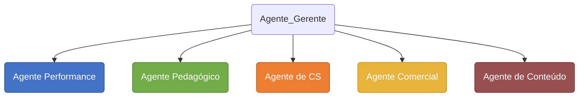

# MULTIPLOS AGENTES

## Objetivo

Utilizar o Hermes Agent para construir um projeto com 5 agentes orquestrado por um agente principal.

## Recursos

Para a execução deste projeto é necessário ter os seguintes recursos:

> * Ter uma VPS (preferencial para rodar 24/7) ou utilize o seu PC local
> * Hermes Agent instalado
> * Disponibilidade de algum modelo LLM da sua preferencia
> * Uma conta no Telegram para criarmos os bot (agentes)
> * Uma conta no Notion para registrarmos a execução do trabalho dos agentes

## Estrutura dos Agentes

---

## 1. Identificando o seu ID no Telegram

Temos que identificar o ID do nosso Telegram, pois será a partir deste ID que nós estaremos conversando com os bots e vise versa. Caso tenha mais alguém que também vai interagir com os bots através do Telegram, então será necessário que este usuário recupere o número do ID dele para ser cadastrado.
Na barra de pesquisa do Telegram, busque por **`User Info`** e clique em @userinfobot. Será aberto uma janela de chat.

Neste chat, digite `/start`

Agora podemos ver que o bot retornou o nosso nome de usuário **@username** e logo abaixo temos o **id:XXXXXXXXX**
Antes de proceguir, monte uma tabela com os dados gerados, pois precisaremos deles mais a frente para rodar os comando de cadastro dentro do Hermes.
Monte algo como:

## 2. Ciando os bots no Telegram

Temos que criar um **Bot** para cada **Agente** utilizando o `@BotFather` do Telegram.
Cada agente é um setor ou seja um departamento dentro de uma empresa

1. Abra o telegram e pesquise por BotFather na aba **Apps**;
      

2. Clique em `Create a New Bot`;  
    

3. Dê um nome para o seu bot no campo **Bot name** e caso queira fazer uma descrição deste bot utilize a proxima linha. Em seguida dê um **username** (Obs: o username do bot **deve** ser terminado com **_bot**) , ao clicar em criar, será gerado um token especifico para este bot. É com este token que usaremos para efetuar um Resquest via API HTTP
    
