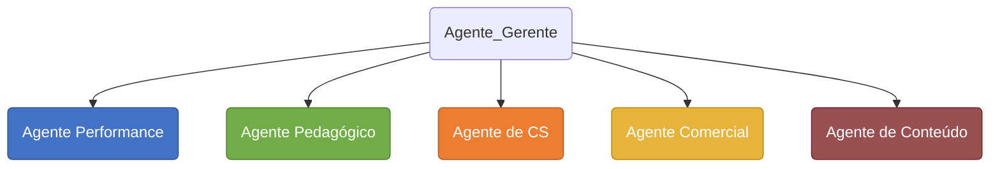

# MULTIPLOS AGENTES

## Objetivo

Utilizar o Hermes Agent para construir um projeto com 5 agentes orquestrado por um agente principal.

## Recursos

Para a execução deste projeto é necessário ter os seguintes recursos:

> * Ter uma VPS (preferencial para rodar 24/7) ou utilize o seu PC local
> * Hermes Agent instalado
> * Disponibilidade de algum modelo LLM da sua preferencia
> * Uma conta no Telegram para criarmos os bot (agentes)
> * Uma conta no Notion para registrarmos a execução do trabalho dos agentes

## Estrutura dos Agentes



---

### 1. Identificando o seu ID no Telegram

Temos que identificar o ID do nosso Telegram, pois será a partir deste ID que nós estaremos conversando com os bots e vise versa.
**Obs.:** Caso tenha mais alguém que também vai interagir com os bots através do Telegram, então será necessário que este usuário recupere o número do ID dele para ser cadastrado.
Na barra de pesquisa do Telegram, busque por **`User Info`** e clique em @userinfobot. Será aberto uma janela de chat.

  
Neste chat, digite `/start`

Agora podemos ver que o bot retornou o nosso nome de usuário **@username** e logo abaixo temos o **id:XXXXXXXXX**
    - Antes de proceguir, monte uma tabela com os dados gerados, pois precisaremos deles mais a frente para rodar os comando de cadastro dentro do Hermes.
    - Monte algo como:
        

### 2. Ciando os Bots no Telegram

Temos que criar um **Bot** para cada **Agente** utilizando o `@BotFather` do Telegram.
Cada agente é um setor ou seja um departamento dentro de uma empresa

1. Abra o telegram e pesquise por BotFather na aba **Apps**;
      
  
2. Clique em `Create a New Bot`;  
    
  
3. Dê um nome usando a referncia criada na planilha para o seu bot no campo **Bot name**, caso queira fazer uma descrição deste bot utilize a proxima linha.
Em seguida dê um **username** (Obs: o username do bot **deve** ser terminado com **_bot**) , ao clicar em criar, será gerado um token especifico para este bot. É com este token que usaremos para efetuar um Resquest via API HTTP
    
  
Ao termino da criação de todos os agentes teremos uma planilha com os Tokens e o ID do Orquestrador (neste caso você com o nome de Agente CTO)
    

Se selecionarmos a aba **Apps** no Telegram e depois clicar em **BotFather**, podemos ver que temos a seguinte estrutura de Bots
    

### 3. Criando Profiles Hermes

Temos que criar os profiles de cada bot (agente) dentro do Hermes com seu respectivo Token junto com o ID do orquestrador, e para isso vamos rodar alguns comandos no terminal para completar este profiles.

1. Abra um terminal de sua preferencia, como o **Powershell** ou **Bash**
2. Execute o seguinte comando no terminal: `hermes --TUI`

```bash
NOME=time-perfomance
TOKEN=gerado no item 2 quando criado o bot
MEU_ID=gerado no item 1 ao rodar o @userinfobot

hermes profile create "$NOME" --clone-from default 2>/dev/null || echo "→ profile já existia, seguindo"
printf 'TELEGRAM_ALLOWED_USERS=%s\nTELEGRAM_HOME_CHANNEL=%s\nTELEGRAM_BOT_TOKEN=%s\n' "$MEU_ID" "$MEU_ID" "$TOKEN" >> ~/profiles/"$NOME"/.env
setsid hermes -p "$NOME" gateway run --replace > "/tmp/$NOME.log" 2>&1 &
sleep 8 && hermes gateway status && tail -5 "/tmp/$NOME.log"
```

3. Reativando o gateway com os novos profiles

```bash
setsid hermes -p default gateway run --replace > /tmp/default-gateway.log 2>&1 &
setsid hermes -p time-perfomance gateway run --replace > /tmp/time-perfomance-gateway.log 2>&1 &
setsid hermes -p time-pedagogico gateway run --replace > /tmp/time-pedagogico-gateway.log 2>&1 &
setsid hermes -p time-cs gateway run --replace > /tmp/time-cs-gateway.log 2>&1 &
setsid hermes -p time-comercial gateway run --replace > /tmp/time-comercial-gateway.log 2>&1 &
setsid hermes -p time-conteudo gateway run --replace > /tmp/time-conteudo-gateway.log 2>&1 &
sleep 8
hermes gateway list
```

> Obs.: Para entendendo o que cada linha do bloco de comando faz, leia o arquivo [comando_block.md](command_block.md)

**Ordem importa**:
    - o .env é gravado antes do gateway subir;
    - se inverter, dois profiles disputam o mesmo token e o bot fica mudo.
    - Cole um bloco de cada vez e espere os 8 segundos do sleep.
    - “Errno 98” na porta 8643 é normal: o primeiro gateway pega a porta de métricas, os outros reclamam e seguem.
    - A reativação é uma linha por profile de propósito, o shell do Hermes recusa for/done.
    - Se algum profile não subir, consulte o log localizado no diretório do Hermes que está em **`/tmp/<nome>-gateway.log`**